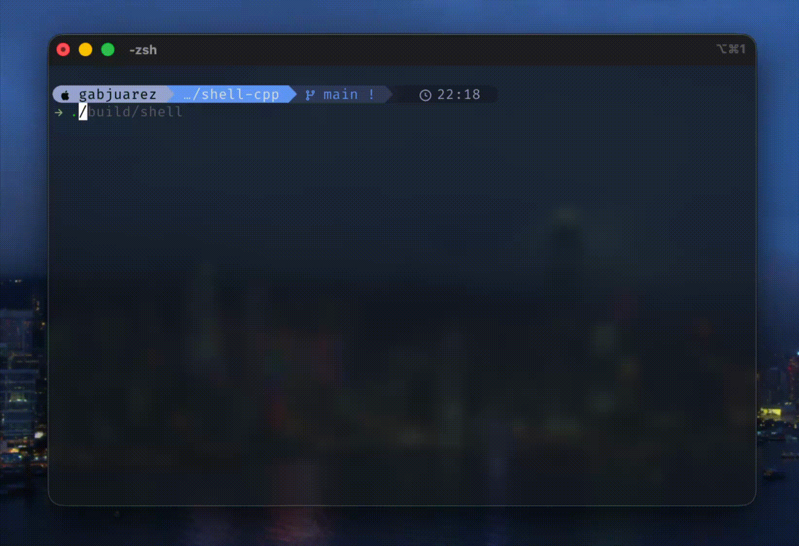

# shell-cpp


A small, focused example of a minimal interactive shell written in modern C++

Preview
------------------


Why this project?
------------------
This repository contains a compact shell implementation intended as a learning project and a starting point for experimenting with command parsing, builtins, and simple tab-completion. It favors clarity and small, well-scoped components.

Highlights 
----------
- Interactive line editing, history and completion via **GNU readline**
- Small builtin command set: **cd**, **pwd**, **echo**, **history**, **type**, **exit**
- Cleanly structured code: parser, completion, commands, helpers and utils
- Optional dependency management via **vcpkg** for reproducible builds

Features
--------
The shell includes a small but useful set of features beyond the basics:

- Multiple pipelines
  - Chain any number of commands with `|`, e.g.:

  ```bash
  cmd1 | cmd2 | cmd3
  ```

- Output redirection
  - Overwrite a file with `>`:
  ```bash
  echo "hello" > out.txt
  ```
  - Append to a file with `>>`:
  ```bash
  echo "more" >> out.txt
  ```

- Input redirection
  - Read stdin from a file using `<`:
  ```bash
  sort < unsorted.txt
  ```
  
PATH & executable lookup
------------------------
This shell uses the `PATH` environment variable to locate external executables. Key details:

- It reads the `PATH` variable from the environment (the usual `:`-separated list of directories).
- Each directory in `PATH` is searched in order. The implementation performs a recursive directory scan inside each `PATH` entry and returns the first file whose stem (filename without extension) matches the command name.

Notes
-----------------
- Because the shell performs a recursive search inside each `PATH` entry, very large directories may slow down command lookup. For best performance, keep `PATH` directories focused (e.g., `/usr/bin`, `/usr/local/bin`, `~/bin`).
- The shell matches the command name to a file's stem; if multiple candidates exist, the first one found (search order + recursive traversal order) is used.
- You can always invoke a command by full or relative path to bypass `PATH` lookup, e.g. `./myprog` or `/usr/local/bin/myprog`.


Quick start
-----------
Clone the repository and pick **one** of the workflows below.

Recommended: build with vcpkg (reproducible)
This project uses **vcpkg in manifest mode** (`vcpkg.json`).  
Dependencies are installed **automatically by CMake**.

```bash
# From project root

# 1) If vcpkg is not present in the repo, clone or place it at ./vcpkg
# 2) Bootstrap vcpkg (first time only)
./vcpkg/bootstrap-vcpkg.sh

# 3) Configure the project (this automatically installs dependencies)
cmake -S . -B build \
  -DCMAKE_TOOLCHAIN_FILE=./vcpkg/scripts/buildsystems/vcpkg.cmake

# 4) Build
cmake --build build
````
Alternative: use system packages (e.g. Homebrew, apt)

```bash
# macOS (Homebrew): install readline
brew install readline

# Debian/Ubuntu:
sudo apt install libreadline-dev

# Then build normally with CMake
cmake -S . -B build
cmake --build build
```
If CMake can't find `readline` on macOS, pass the Homebrew prefix:
```bash
cmake -S . -B build -DCMAKE_PREFIX_PATH="$(brew --prefix readline)"
cmake --build build
```

Run the program (convenience script)
-----------------------------------
A small script `program.sh` compiles and runs the binary. It will use the vcpkg toolchain if `VCPKG_ROOT` is set.

```bash
# Make the script executable once
chmod +x program.sh

# If using vcpkg in ./vcpkg (recommended):
export VCPKG_ROOT="$PWD/vcpkg"
./program.sh

# Or, run the binary directly after building:
./build/shell
```


